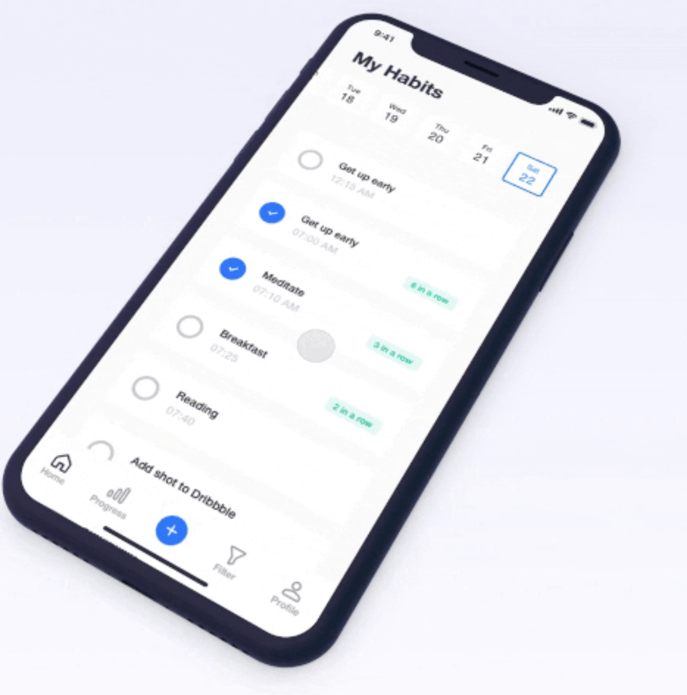

# habits-tracker

A habit tracker app (Made it for myself :P)

### Features

- its a PWA ;)
- Use's IndexedDB
- Click Habits title to go today's date.
- Press & Hold a habit to edit
- Press & Hold and un-select all days (M to S) to delete a habit. (This is intention to keep track of added habits)
- Click all habits in top to see all habits (active, deleted) with days.

### TODO

- [] - Stats of habits based on any months.

### [Design Idea](https://dribbble.com/shots/5743142-Habit-app) from [Aleksey Tsvetkov](https://dribbble.com/tsvetkov)

  <b>Home Screen</b>:
  

  <b>Add Habit Screen</b>:
  

#### Contributions

- If you wish to contribute to this repository, fork it and send a PR 😬.
- And, if you like the repo, 🌟 it.

##### MIT Licensed
